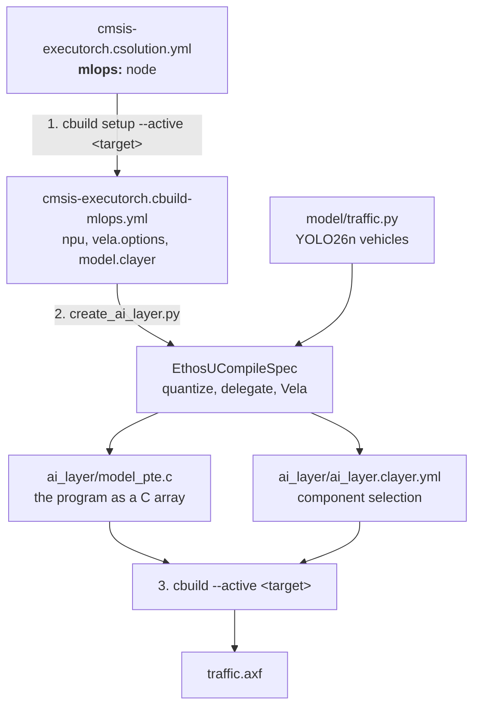

# The MLOps flow

The `mlops:` node in `cmsis-executorch.csolution.yml` is the central
definition of the Ethos-U target of the traffic counter. It follows the CMSIS-Toolbox
[MLOps information](https://open-cmsis-pack.github.io/cmsis-toolbox/build-overview/#mlops-information)
specification. This document explains how the three build steps use and
propagate that information.



## 1. `cbuild setup` turns the csolution into `*.cbuild-mlops.yml`

The csolution is the only place where the NPU is described:

```yaml
solution:
  mlops:
    description: YOLO26n vehicle detector of the traffic counter for the Ethos-U55
      of the Ensemble E7's M55-HP
    npu:
      type: Ethos-U55
    vela:
      system: RTSS_HP_SRAM_MRAM        # system-config from the Ensemble pack's Vela config
      memory: Shared_Sram              # memory-mode from the Vela config
    model:
      clayer: $AI-Layer$
      name: TrafficVehicles
    hardware:
      target: AppKit-E7       # <target-type>[@<target-set>] of the board;
                              # named explicitly, 2.14.1 detects none
    simulator:
      target: SSE-300-U55     # <target-type>[@<target-set>] of the FVP
```

`cbuild setup cmsis-executorch.csolution.yml --active AppKit-E7`
resolves it and writes `cmsis-executorch.cbuild-mlops.yml`:

```yaml
cbuild-mlops:
  generated-by: csolution version 2.15.1+p3-gf46d68bf
  description: YOLO26n vehicle detector of the traffic counter for the Ethos-U55 of the Ensemble E7's M55-HP
  processor:
    type: Cortex-M55
  npu:
    type: Ethos-U55
    macs: 256
  vela:
    ini: .cmsis/ensemble_vela.ini
    options: --accelerator-config ethos-u55-256 --system-config RTSS_HP_SRAM_MRAM --memory-mode Shared_Sram
  model:
    clayer: ai_layer/ai_layer.clayer.yml
    name: TrafficVehicles
  hardware:
    active: AppKit-E7
    cbuild-run: out/cmsis-executorch+AppKit-E7.cbuild-run.yml
    output:
      - file: out/traffic/AppKit-E7/Release/traffic.axf
        type: elf
  simulator:
    active: SSE-300-U55
    cbuild-run: out/cmsis-executorch+SSE-300-U55.cbuild-run.yml
    output:
      - file: out/traffic/SSE-300-U55/Release/traffic.axf
        type: elf
    model: ${workspaceFolder}/.vscode/fvp.sh
    config-file: board/Corstone-300/fvp_config.txt
```

The Ensemble device family pack declares the NPUs of the device (the E7's
HP core has an Ethos-U55 with 256 MACs) and ships a Vela configuration file,
so the toolbox fills in `npu.macs`, copies the file to
`.cmsis/ensemble_vela.ini` and adds `--accelerator-config`. The FVP's
Ethos-U55-256 runs the same command stream: the system configuration only
steers how Vela schedules for the E7's SRAM and MRAM. The
`hardware:` and `simulator:` sections are what a test runner needs to load
the image on the board or to execute it on the FVP.

This is the hand-over point to the MLOps side: everything a model-export
pipeline needs to know about the target is in this one file, and nothing in it
is specific to this example's Python code.

`cbuild setup` writes the file even when the AI layer does not exist yet, so
the flow also works on a checkout without a generated layer.

## 2. `create_ai_layer.py` turns `*.cbuild-mlops.yml` into the AI layer

`python create_ai_layer.py cmsis-executorch.cbuild-mlops.yml` stands in
for an MLOps system. It reads the file and:

1. builds ExecuTorch's `EthosUCompileSpec` from `npu:` and `vela:` -- the
   accelerator (`ethos-u55-256`), system config and memory mode come from
   there, so the Python code contains no NPU configuration;
2. exports the methods `model/model.py` lists (YOLO26n of
   `model/traffic.py`, the method `detect`): quantizes them, delegates the
   whole graph to the Ethos-U and compiles it with Vela;
3. reads the operators the resulting program still calls on the CPU and looks
   up the matching components in the `PyTorch::ExecuTorch` pack (the version
   `cbuild setup` resolved, from `*.cbuild-pack.yml`);
4. writes the layer into the directory of `model.clayer`:

| File | Content |
|------|---------|
| `ai_layer/ai_layer.clayer.yml` | runtime, kernel utilities and registration, Ethos-U backend and the operator components the program uses |
| `ai_layer/model_pte.c` / `.h` | the program as a 16-byte-aligned C array, `model_pte` / `model_pte_size` |
| `ai_layer/model.pte` | the program itself, for inspection (not committed) |

The clayer and the C array are committed, so a checkout builds without
Python. For a fully delegated model with quantized IO the component list is
short: `Runtime`, `Kernel Utils`, `Kernel Registration` and `Backend EthosU`.
Everything else in the pack is never compiled, let alone linked.

## 3. `cbuild` builds the application

`cbuild cmsis-executorch.csolution.yml --active AppKit-E7` (or
`--active SSE-300-U55`) is a plain CMSIS build without any Python. The cproject knows nothing about the model: it
lists the application source and the two layers, and the AI layer contributes
both the component selection and the model data.

Because the layer is complete before CMSIS-Toolbox resolves components, a model
change that changes the operator set is just another run of step 2 followed by
step 3.

## Changing the model or the target

- **Another model:** edit `model/traffic.py` (or what `model/model.py`
  returns), run steps 2 and 3.
- **Another NPU configuration:** edit the `mlops:` node (and add the matching
  `target-types:` entry and board layer), run steps 1 to 3. For example the
  E7's high-efficiency core and its Ethos-U55 with 128 MACs:

  ```yaml
  mlops:
    npu:
      type: Ethos-U55
    vela:
      system: RTSS_HE_SRAM_MRAM    # was RTSS_HP_SRAM_MRAM
      memory: Shared_Sram
  ```

  The Python side needs no changes at all.
